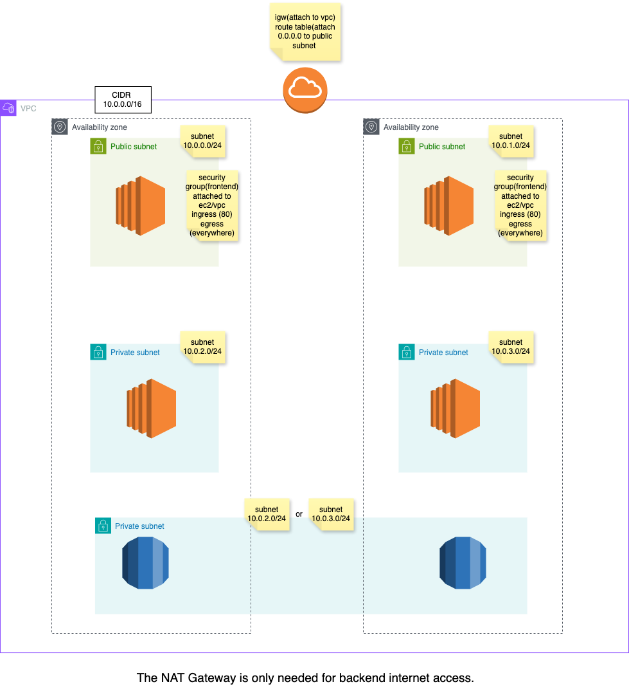

# Three Tier Architecture



## Prerequisites (I recommend researching all of these if needed)

1. Install AWS CLI (configured with credentials)
2. Add IAM permissions for new user account from root (good practice) - I gave Administrator access
3. Install Terraform 
4. SSH key (for connecting to EC2)

---
when deleting terraform and creating new one - either. change name of secretsmanager(new name) or force delete using below
as it dont allow you to create it again due to policy

```bash
aws secretsmanager delete-secret --secret-id rds_db_password --force-delete-without-recovery
```